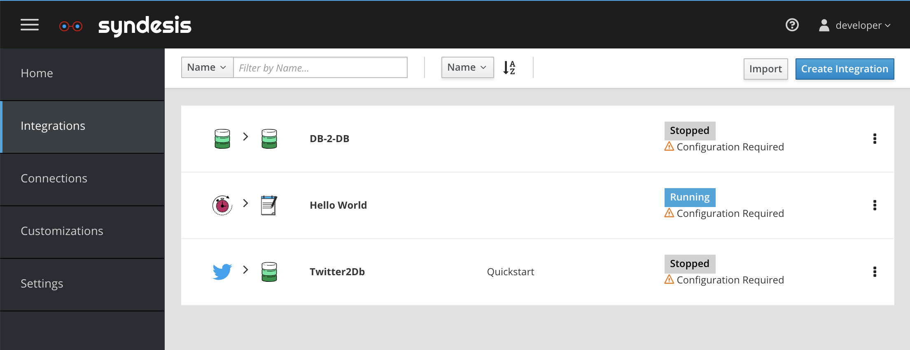

# Syndesis Quickstarts


<i>Let's fire it up! Syndesis quick start Firestarters light integration fires quickly and easily. Replaces messy camel and kindling. Each 18oz pack contains 4 firelighters. Great for fireplaces, outdoor fireplaces and fire pits, wood stoves, and campfires. Syndesis quick start Firelighters are made from wax and a blend of recycled and **renewable** biomass fibers.</i>

## Introduction to Syndesis

Syndesis is a cloud native application targeted at systems integration. It leverages Apache Camel, and adds a UI layer that helps developers, and more importantly the more technically business analysist, to create integrations without writing any code. Integrations are deployed as Spring Boot applications inside a container onto OpenShift. 

The easiest way to try Syndesis is to use a trial of the product called Fuse Online. You can sign up at https://www.redhat.com/en/technologies/jboss-middleware/fuse-online, and skip right to the QuickStart section.
However if you’re like me and you want to be able try things out by running it locally, you probably want to run the Syndesis project bits. This is where this blog is about. I will take you through to the few straightforward steps to
  * Install a mini cloud ‘MiniShift’ on your laptop
  * Install Syndesis on Minishift
  * Run some QuickStarts

## Install a local mini cloud called MiniShift
In order to have a small cloud running on your laptop you need to install MiniShift. MiniShift is a one node version installation of [OpenShift OKD](https://docs.okd.io/latest/welcome/index.html) running in a virtual machine. MiniShift supports a few virtualization technogies such as KVM, xHyve, Hyper-V and VirtualBox. To use **xHyve** on **OSX** use
```
brew install docker-machine-driver-xhyve
sudo chown root:wheel $(brew — prefix)/opt/docker-machine-driver-xhyve/bin/docker-machine-driver-xhyve
sudo chmod u+s $(brew — prefix)/opt/docker-machine-driver-xhyve/bin/docker-machine-driver-xhyve
```
For more details on the commands above, use a different virtualization technology, or if you’re on a different platform see [Setting Up the Virtualization Environment](https://docs.okd.io/latest/minishift/getting-started/setting-up-virtualization-environment.html). To install minishift itself use
```
brew cask install minishift
```
or simply download the minishift binary from [github](https://github.com/minishift/minishift/releases). Hop onto IRC (#ipaas-dev) to chat with us if you need help with any of this!

## Install Syndesis
We will now download the docker images from our official dockerhub repository and start them on your minishift installation using
```
bash <(curl -sL https://syndes.is/start)
```
This will take a few minutes depending on your download speed, but this is all there is to it. For more details see syndesis.io.

## Let's run some QuickStarts

Syndesis lets you build application without writing any code. Perhaps the easiest way to learn about Syndesis is to simply run to quickstarts. The quickstarts are zero code, so instead we offer Syndesis integration `exports` from scenarios we built for you. You can try them out by `importing` an export as an integration into Syndesis. After the import you sometimes may need to re-enter some connection information like passwords. The accompanying README should detail this. We have ordered the Quickstarts loosely ordered by simplicity, so it is recommended to start from the top of this list. 

### Integrations
  * [Hello World](hello-world) - log 'Hello World!'
  * [DB 2 DB](db-2-db) - read from a database table, insert in another database table
  * [FHIR 2 FHIR](fhir) - breath 'fire' from a FHIR REST service and update the same record
  * [Twitter 2 DB](twitter-2-db) - search twitter and push matches to a database
  * [Twitter 2 GMail](twitter-2-gmail) - search twitter and send out matches in the body of an email
  
### API 
  * [API Provider](api-provider) - create and expose a REST interface to (remotely) interact with integration flows.
  
  
  
### Acquire OAuth Credentials for
  * [Twitter](twitter-2-db/TwitterCredentials.md)
  * [GMail](twitter-2-gmail/GmailCredentials.md)
  
  
## Become part of the Syndesis community!


We are an Open Source, Apache 2 Licensed project. You are free to use our project but to ensure the health of our project we need your feedback. Become a part of [our community](https://syndesis.io/community/). Did I menation we love hearing your experiences? Please log any issues you find or even better contribute a patch back for it. Good luck, and please give us feedback! We love you!

[@Syndesisio](https://twitter.com/syndesisio)

