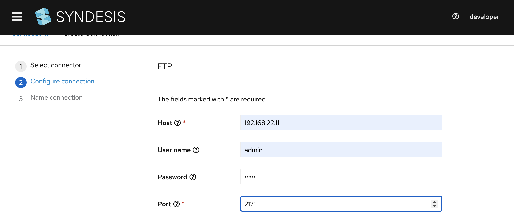
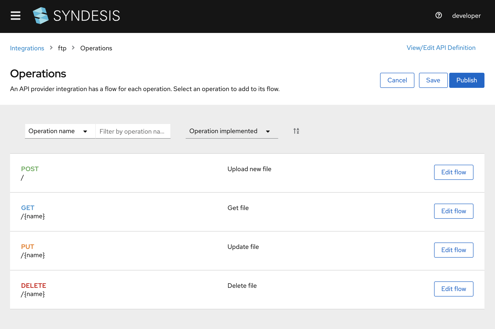

# API Provider with FTP

## Introduction
In this scenario we start with an OpenAPI/Swagger file [ftp-api.json](ftp-api.json?raw=true). We will demonstrate how to create a REST API that can invoke your integration flows. Note that at the moment the example integrations use the FTP connector only. You can add other Connections to the flows if you want to.


## Screencast of this Quickstart

Link to a screencast of this quickstart on our youtube channel:

[](https://youtu.be/sox8SSqJ0zQ)

*`<<Click to Play>>`*


## Prerequisite
For this quickstart you will need access to an FTP server. If you don't have one you can download one from the Apache [Mina](https://mina.apache.org/ftpserver-project/downloads.html) project. For this demo I used the 1.1.1 Release. After etracting it you can start it from top level directory using
```
./bin/ftpd.sh res/conf/ftpd-typical.xml 
```
This will start the server with default `user/pw` of `admin/admin`. Next create an new directory res/home/inbox
```
mkdir res/home/inbox
```

In Syndesis you can now create an FTP connection, using the FTP connector [Connections > Create Connection] and select FTP.
As shown in Figure 1, fill out the first 4 fields: hostname or IP address of your FTP server, username (admin), password (admin) and port (2121). 


*Figure 1. Create FTP Connection*


## Getting Started

You can start by using the API Provider connector and selecting the [ftp-api.json](ftp-api.json?raw=true) to implement your own flows, or you can start using the export. Here we describe using the export so you can get a feel for how things work quickly. If you want to set up your own flows you can follow the video tutorial from above. In the Syndesis UI navigate to `Integrations` and click on the `Import` button in the right top corner. Now you can select the [TaskAPI-export.zip](TaskAPI-export.zip?raw=true) file and start the import. On a succesful deployment, go to edit this integration. You will see that this integration contains four flows:

| Flow               | Path             | FTP Action (Directory: inbox)|
|--------------------|------------------|-----|
| Create File        | POST /api        | UploadNamedFile - If file exists: fail |
| Get File by FileName    | GET /api/{id}    | DownloadNamedFile - Delete file after download: no |
| Update File by FileName | PUT /api/{id}    | UploadNamedFile - If file exists: override |
| Delete File by Filename | DELETE /api/{id} | DownloadNamedFile -  Delete file after download: yes ||
  

*Figure 2. Endpoints in the File API*

We've implemented each flow using just one connection: the SampleDB Connection. We could have used any other connection this is nice and simple, so it does the job demonstrating what the API Provider is all about.


*Figure 3. 'Get' Flow Implementation*

Besides the SampleDB we use the DataMapper and don't forget to click on the final `Provided API Return Path` step to map Error to HTTP Return codes (which are defined in the Swagger API).


*Figure 4. Return Error Mapping*

Navigate back to the Integration Detail screen and click to `Start` (or `Deploy`) this integration. The deploy process will take a few minutes, but at the tail end of it it will show the URL at which it is live, the `external URL` which should be something like 

https://i-ftp-syndesis.192.168.42.71.nip.io

That's it, your integration is now live! Let's create an environmental parameter with the external URL using

export externalURL="https://i-ftp-syndesis.192.168.42.71.nip.io"

Make sure to use the externalURL for your integration. Now we are ready to play with the Task API:

### 1. Create File "/" 

```
curl -k --header "Content-Type: application/json" --request POST \
        --data '{"fileName":"1.json", "content":"my first file :)!"}' $externalURL
        
curl -k --header "Content-Type: application/json" --request POST \
        --data '{"fileName":"2.json", "content":"my second file :|!"}' $externalURL
        
curl -k --header "Content-Type: application/json" --request POST \
        --data '{"fileName":"3.json", "content":"my third file :(!"}' $externalURL

```

### 2. Get File by Filename "/{name}"

```
curl -k $externalURL/1.json

{"fileName":"1.json", "content":"my first file :)!"}
```
 
### 3. Update File by Filename "/{name}" 

```
curl -k -X PUT $externalURL/1 --data '{"fileName":"1.json", "content":"my first file has more content now!"}'

{"fileName":"1.json", "content":"my first file has more content now!"}
```

### 4. Delete File by Filename "/{name}" 

```
curl -k -X DELETE $externalURL/1.json
```

## What did we learn?
* We learned to generate a Rest service from a OpenAPI/Swagger document
* We learned to implement each flow using Syndesis Connectors and Steps
* We learned to map Exceptions to HTTP return codes
