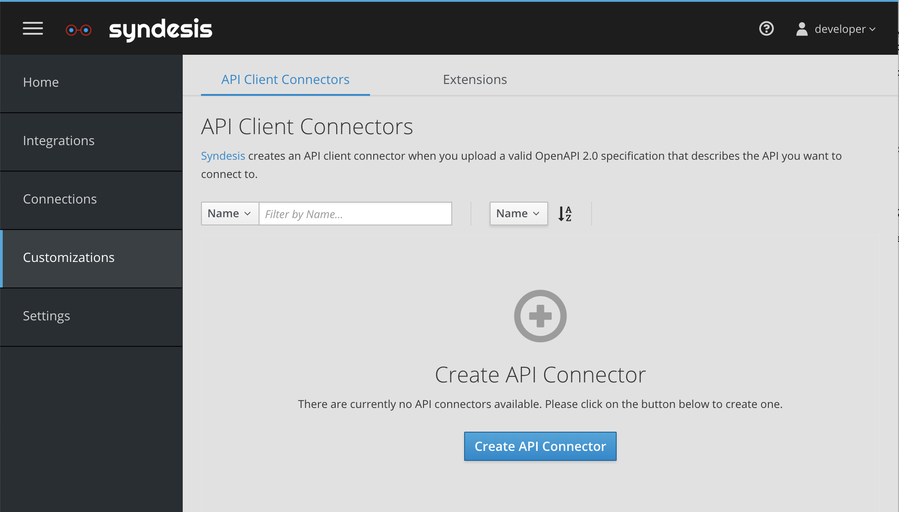
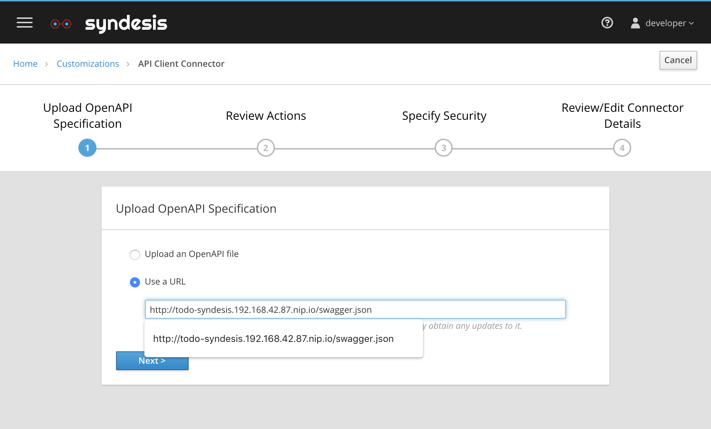
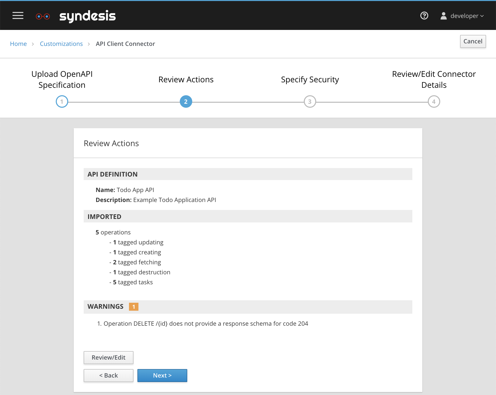
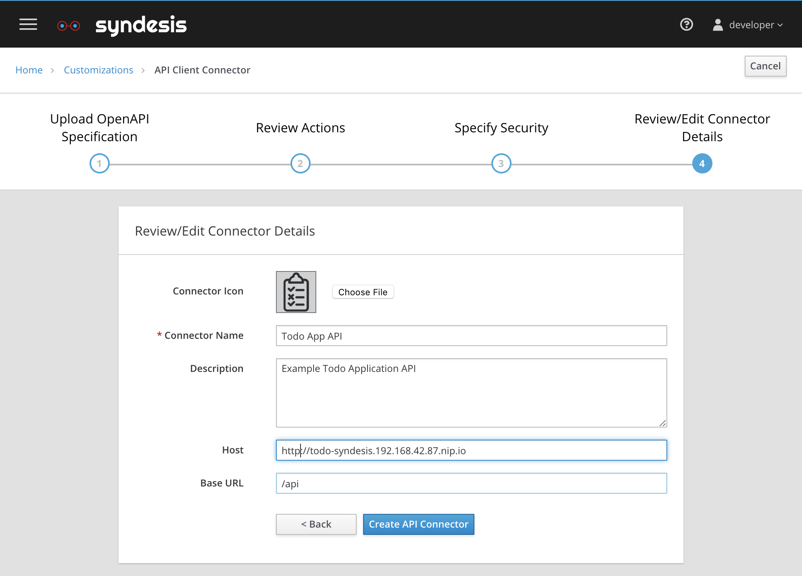
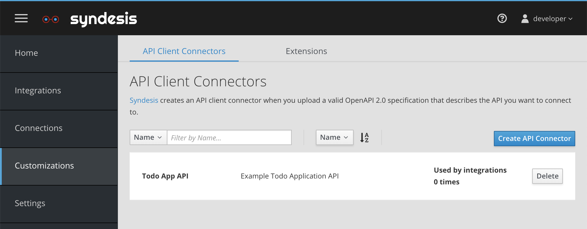
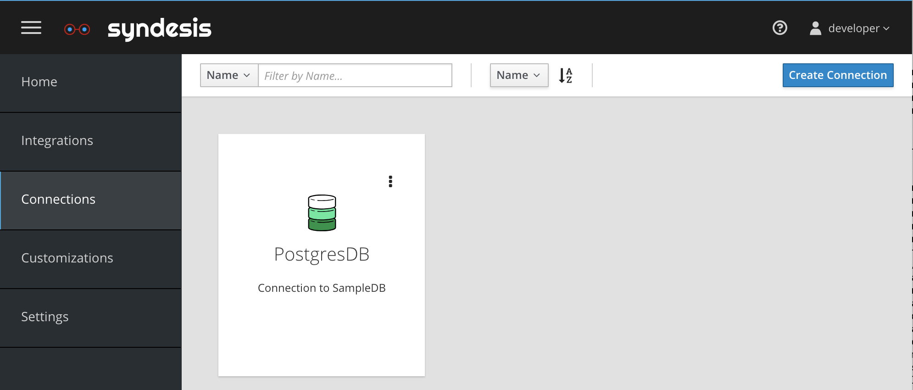
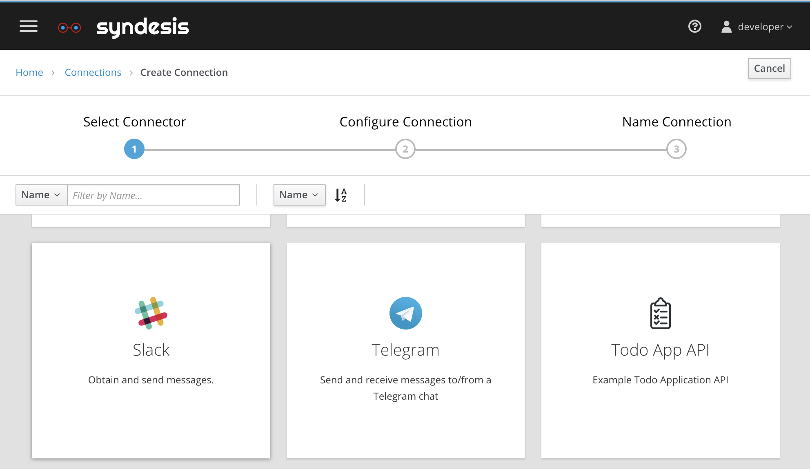
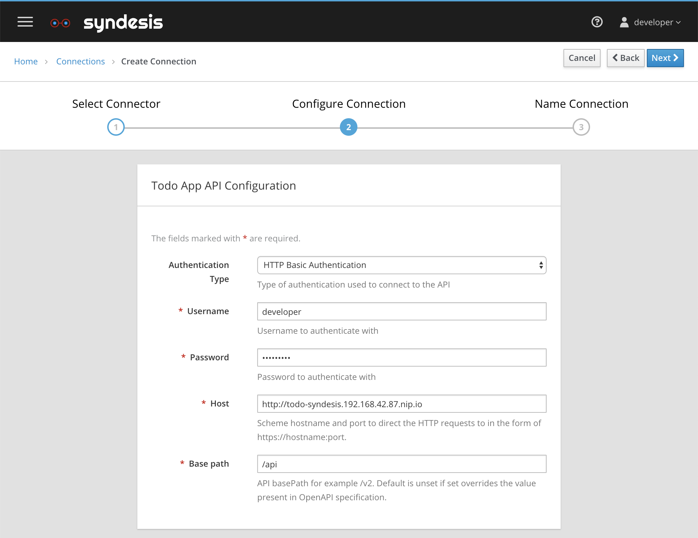
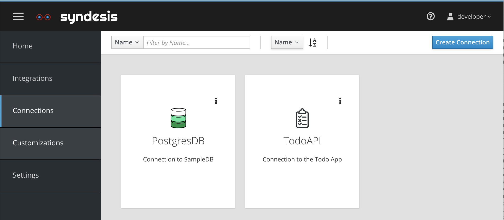

# Create a Connector for the TODO REST API

## Introduction
Many application have a RESTful API. Syndesis allows you to create a *custom* connector specific for a certain application. In this case we pick the TODO REST API. To start creating such a API Client Connector navigate to `Customizations > API Client Connectors` and click on the blue `Create API Connector` button


*Figure 1. Create a Custom API Client Connector*

## OpenAPI/Swagger To Connector
To create such an API Client we need to provide it with an OpenAPI/Swagger document. When running on Minishift you can copy the output of the following command

```
echo http://todo-syndesis.`minishift ip`.nip.io/swagger.json
```
and past it into the Use a URL Field

*Figure 2. Paste into the From URL field*


*Figure 3. Review RESTful Actions*

Then upload the todo-icon.png from the quickstart directory and change the url from `https` to `http`, this because our certificated a selfsignedm and we want to avoid issues with that.


*Figure 4. Edit Icon and URL*


*Figure 5. See the new API Client Connector called `Todo App API`*

## Connector to Connection
Finally we need to create a new TODO API Connection


*Figure 6. Create Connection*


*Figure 7. Select TODO App API Connector*


*Figure 8. Add Credentials*


*Figure 9. Connection is ready for use*

