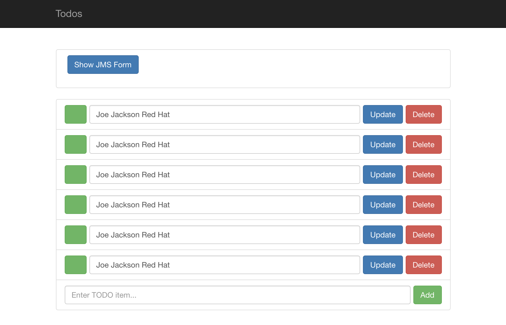

# Database to REST 
-- **using the API Connector to create a custom Todo App API Connector** --

## Introduction
The `API-Connector` is a customizable connector that can be configured to connect to **ANY** REST API. All you need is an openapi/swagger description document of the REST service. In this quickstart we will use the swagger description of the Syndesis Todo App, and create a [Todo API Connector](APIConnector.md) that uses Basic Auth for its authentication. There will be a different QS on how to use the API Connector with OAuth.

This scenario periodically uses data from the contect table in the Postgres SampleDB to call the Task Create endpoint of the TODO App API.

## Screencast of this Quickstart

Link to a screencast of this quickstart on our youtube channel:

[](https://youtu.be/Ervr46Kv8VU)


## Getting Started

You can follow with the video above to build the integration or you can import the [DB-2-APIConnector-export.zip](DB-2-APIConnector-export.zip?raw=true), or you can follow the instructions below. 

Before you can create the integration make sure you created your own custom [Todo API Connection](APIConnector.md). To Start select the PostgresDB Connection to the SampleDB and select the `Periodic SQL Invocation` action using 

`SELECT * FROM contact`

Accept the default to have it invoke every minute. For the Finish connection select the TodoAPI Connection, and select the `Create new Task`. Finally create a Datamapper Step to map 

`firstName lastName company` -> `task`


*Figure 1. Map Contact fields to task*

Obtain the todo app url by executing
```
echo https://todo-syndesis.`minishift ip`.nip.io/
```
and see a new task with content 'Joe Jackson Red Hat' appear every minute.


*Figure 2. Todo App with new Tasks appearing*

## What did we learn?

* We created a **custom** API Client connector to the Todo App REST API using its openapi/swagger description
* We created a new TodoAPI Connection using Basic Auth
* We build an integration from a the SampleDB contact table to the Todo App.
* We used the datamapper to map in and output data.

## Extra credit

Set up an integration to Reverb using OAuth like [@zregvart](https://twitter.com/zregvart) did:

[](https://youtu.be/UwPzY3svD-s)

Send us back the instructions and don't forget to add the instruction to obtain the OAuth credentials from Reverb, as well as the export.zip file!
