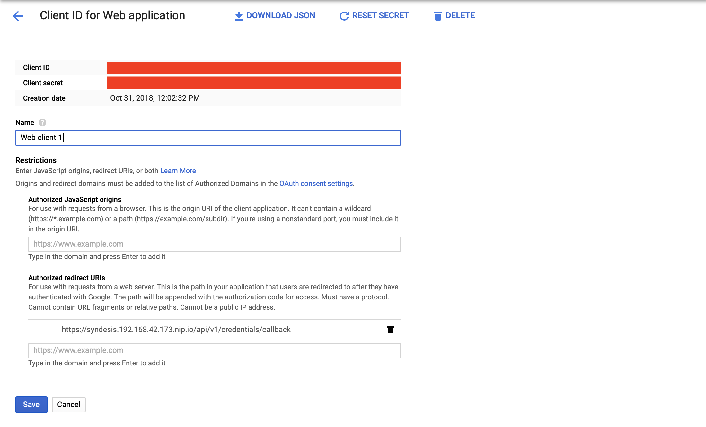

# Obtaining Credentials to use the GoogleSheets API
The absolute first step is to have a gmail account. I don't think I need to help you with that but after that things get a bit more complicated. 

## Syndesis GoogleSheets Settings
Syndesis is using the [OAuth](https://en.wikipedia.org/wiki/OAuth) Standard to connect to the GoogleSheets API. On the `Settings` section on Syndesis it requires you to enter a Consumer Secret and Consumer Key (see Figure 1)

*Figure 1. Syndesis GoogleSheets Settings*

The workflow to obtain the clientID and Secret are similar to the instructions for [GMail Creds](../twitter-2-gmail/GmailCredentials.md) but make sure to add the GoogleSheets API from the Library so that you can add it to your scope. If you are on minishift the `autorized domain` will be `nip.io`.

*Figure 2. Select GoogleSheets API Scope*

and also make sure to set the callback url which you can obtain from the top of the Settings screen in the Syndesis UI.

*Figure 3. Set the Callback URL*

You can now use the clientId and secret on this page for the Syndesis Settings for GoogleSheets shown in Figure 1. And finally you can create a GoogleSheets Connection and these credentials will be used.

