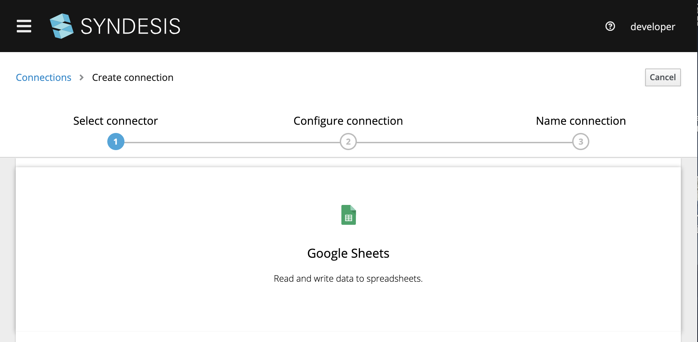
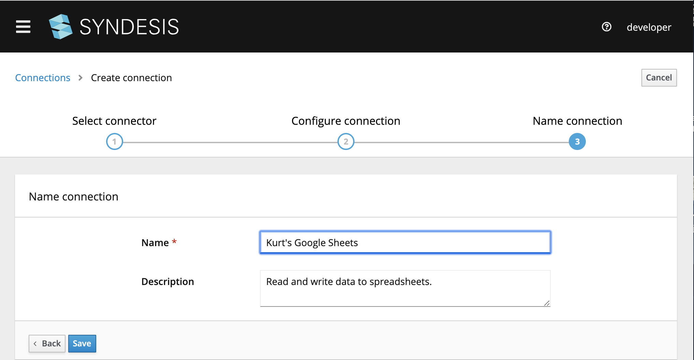
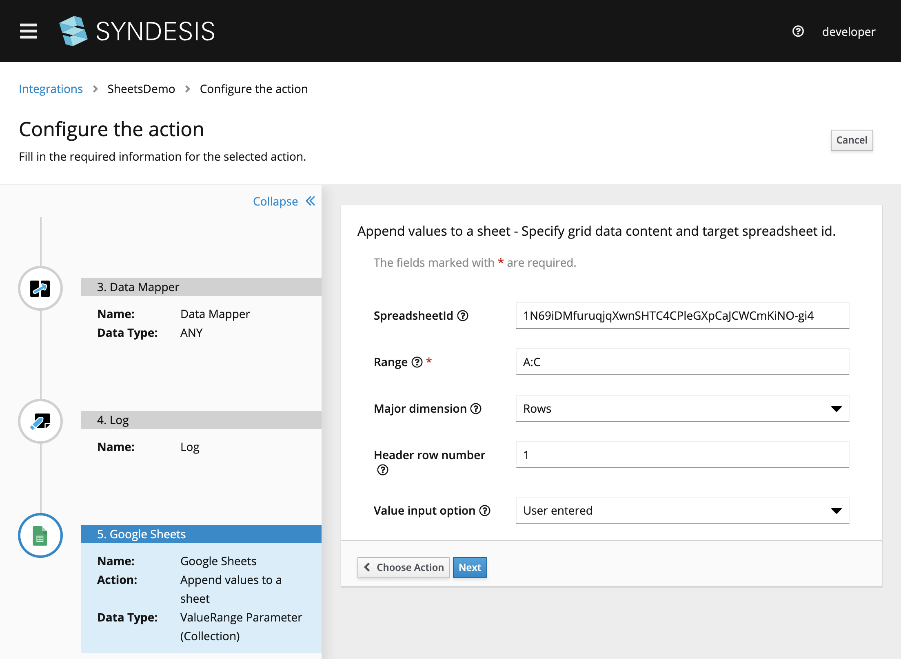
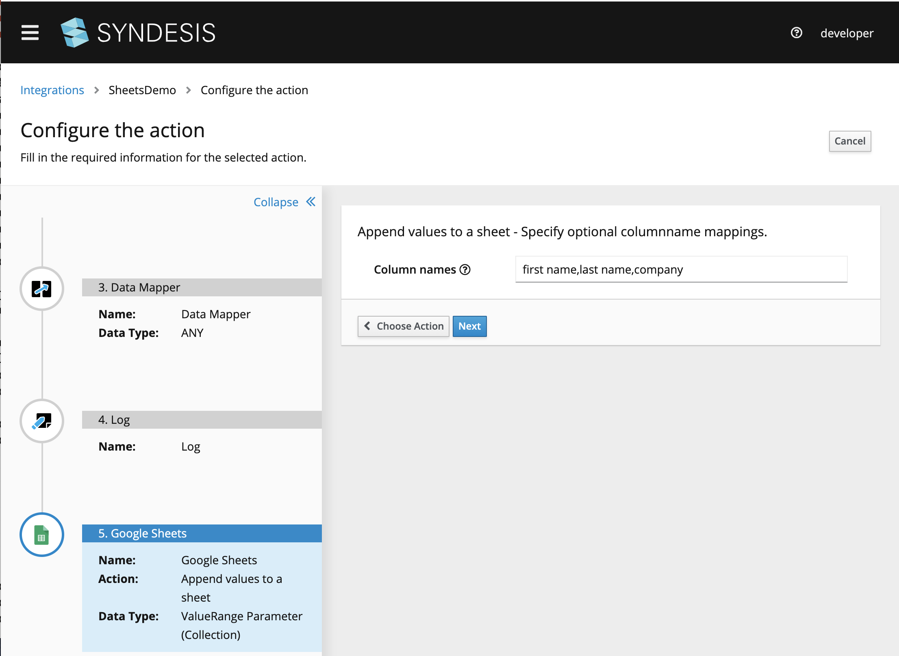
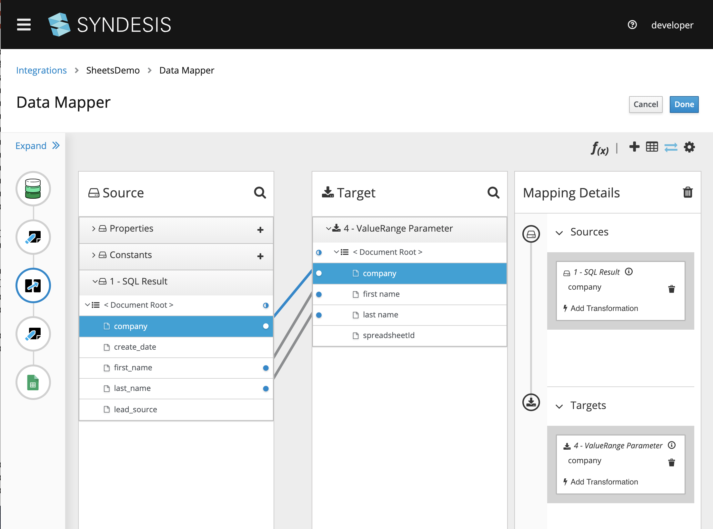

# Database to GoogleSheet

In this quickstart we will demonstrate setting up an integration between a Database and GoogleSheets. There is one prerequisite which is that you set up your credentials for google sheets.
  * Please follow [Google API Creds](GoogleSheetsCredentials.md). 

## Screencast of this Quickstart

Link to a screencast of this quickstart on our youtube channel:

[](https://youtu.be/DN5dfDP7Tkw)

*`<<Click to Play>>`*


## Getting Started

First we need to set up a `Connection` using the GoogleSheets `Connector`. For that you need to go to connections and click the `Create Connection` button. 


*Figure 1. Create Connection*


*Figure 2. Configure Connection*


*Figure 3. Google OAuth Authorization*


*Figure 4. Name and Save the Connection*


## Setting up the Integration

You can follow with the video above to build the integration or you can import the [SheetsDemo-export.zip](SheetsDemo-export.zip?raw=true), or you can create the a brand new integration.

The Start is a DB connecton that executes a search every 1 minute, using the following query

```
SELECT * FROM CONTACT
```

The Finish connection is the GoogleSheets Connection.


*Figure 5. GoogleSheets Finish Connection - screen 1*


*Figure 6. GoogleSheets Finish Connection - screen 2*

add a DataMapping Step in between


*Figure 7. Add DB to GoogleSheets DataMapping Step*


You are now ready to deploy the integration, and you should start seeing rows being created for each time it scans the database.

## What did we learn?

* We learned how to use OAuth Credentials to create a GoogleSheets Connection.
* We learned how to use a GoogleSheets connector to push records from the db into a google sheet
* We learned to use the datamapper to map data from the Database to a Google Sheet.


