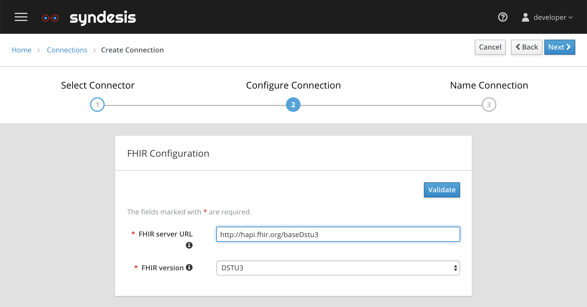
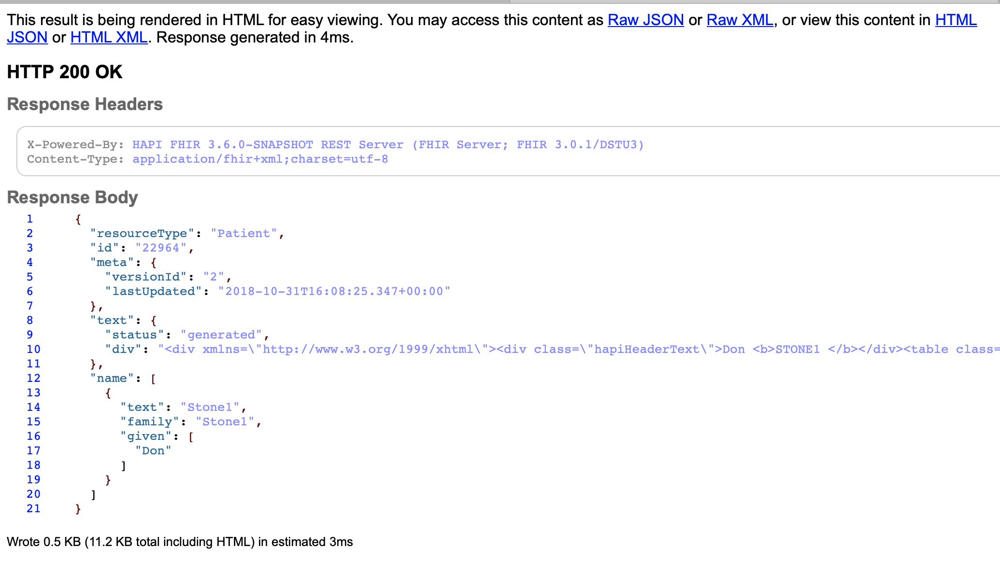
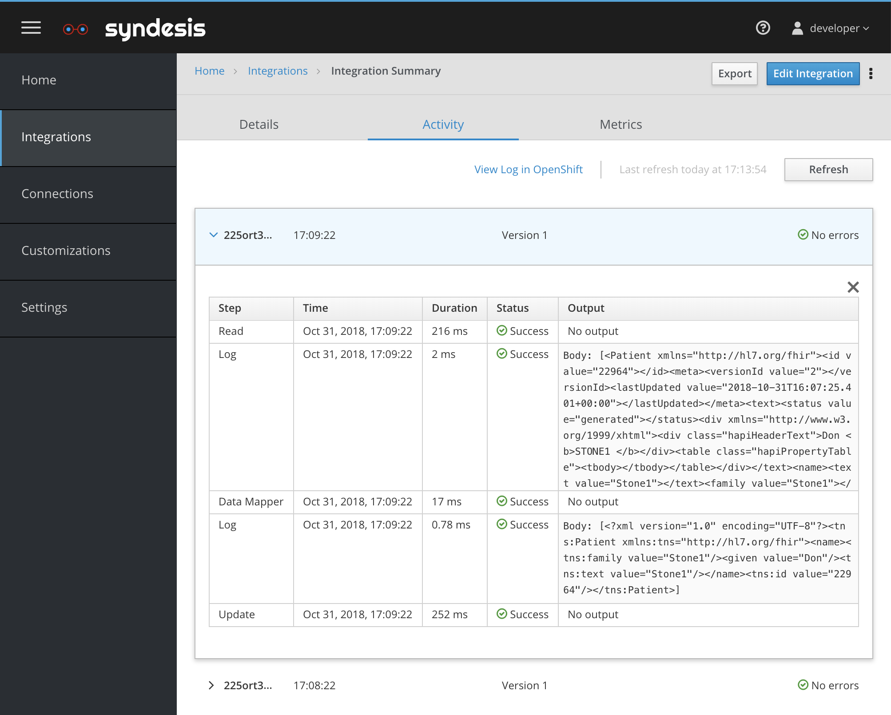

# FHIR (Fast Healthcare Interoperability Resources)


## Introduction

The [FHIR](https://www.hl7.org/fhir/) standard is developed specifically for Healthcare interoperability.
This scenario periodically reads a record from a FHIR service and then updates the same record. 

## Screencast of this Quickstart

Link to a screencast of this quickstart on our youtube channel:

[](https://youtu.be/8nw-L0u4HzM)


## Getting Started

You can follow with the video above to build the integration or you can import the [FHIR-export.zip](FHIR-export.zip?raw=true), or you can create from scratch starting with configuring a FHIR Connection. For this I'm using the following FHIR service endpoint

```
http://hapi.fhir.org/baseDstu3/
```


*Figure 1. Configure the FHIR Connection*

The start action is a Simple Timer that fires every minute. The finish connection is a FHIR connection where we select the `update` action. Then we add a step in the middle to read a Patient record from the same FHIR connection. You can verify the Patent 22964 record exists by looking at

```
http://hapi.fhir.org/baseDstu3/Patient/22964
```


*Figure 2. Patient 22964 Data*

Finally we add a DataMapper Step to map

```
tns.id/tns:value -> tns.id/tns:value
tns.name/tns.family -> tns.name/tns.family
tns.name/tns.given -> tns.name/tns.given
tns.name/tns.family -> tns.name/tns.text/tns.value
```

and add Log Steps before and after the DataMapper, then Deploy the integration and the activity log should show activity.


*Figure 3. FHIR Logging*

## What did we learn?

* We learned how to Read and Update a record on a FHIR server.
* We learned to navigate the complex FHIR API using JSON/XML in the DataMapper and we mapped some fields.
