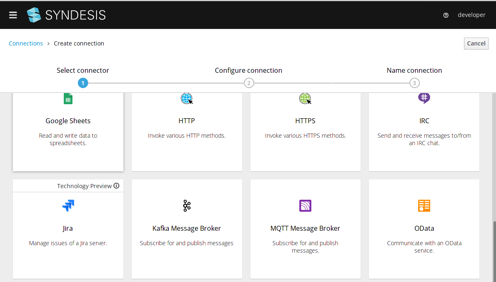
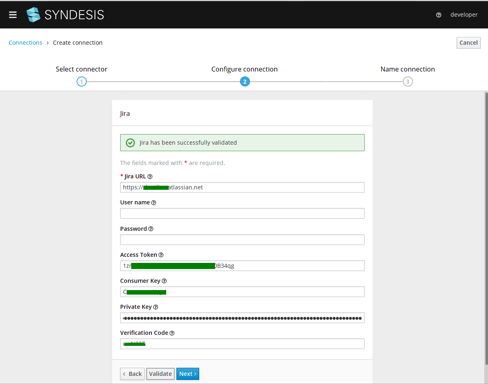

# How to configure Jira OAuth connection

Jira connection supports basic authentication with username/password or OAuth. Jira recommends OAuth as it is more secure.
There is a page explainig [OAuth support for Jira](https://developer.atlassian.com/cloud/jira/platform/jira-rest-api-oauth-authentication).

This quickstart uses the OAuth approach.

Before you add the `Jira` connection, you should setup an [Application Link on Jira server](https://developer.atlassian.com/cloud/jira/platform/jira-rest-api-oauth-authentication/#overview).

Then after that, you can add a `Jira` connection.

*Figure 1. Create Connection*

After you set the parameters, validate the connection.

*Figure 2. Configure Connection*

*Figure 3. Save Connection*

