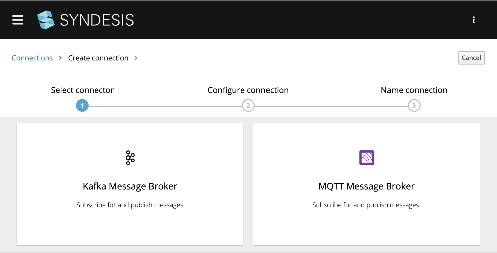
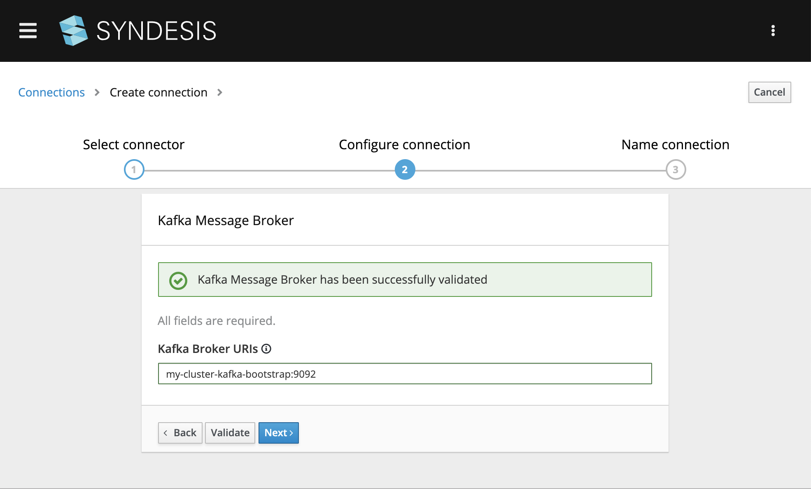
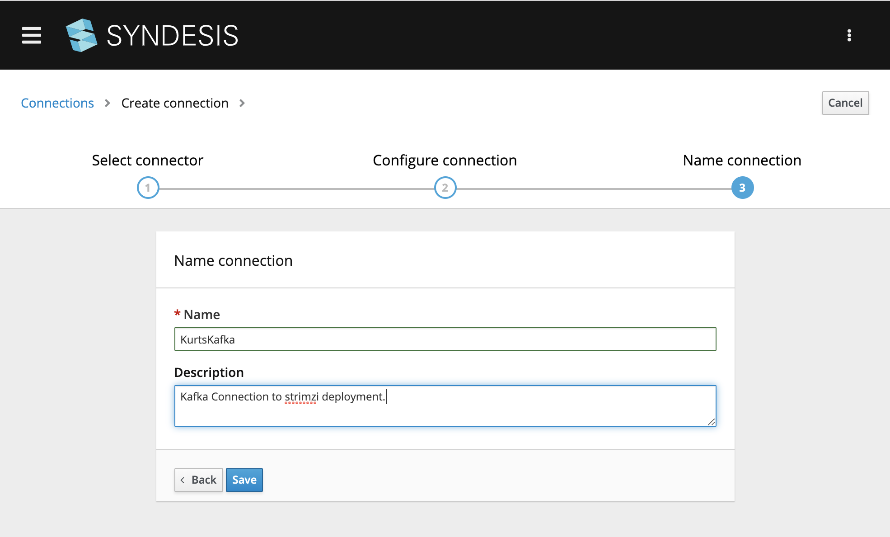

# Kafka Broker Deployment

To run a Kafka Broker in your `my-project` you can use [strimzi](https://strimzi.io/quickstarts/okd/).

## Installation

First login your minishift installation as the `cluster-admin` user, and deploy the strimzi install files:

```
oc login -u system:admin
oc apply -f https://github.com/strimzi/strimzi-kafka-operator/releases/download/0.11.4/strimzi-cluster-operator-0.11.4.yaml -n myproject
# Apply the `Kafka` Cluster CR file
oc apply -f https://raw.githubusercontent.com/strimzi/strimzi-kafka-operator/0.11.4/examples/kafka/kafka-persistent-single.yaml -n myproject
# Watch the pods come up
oc get pods -n myproject -w
```

The installation is complete, once the `my-cluster-entity-operator` is running, like:

```
my-cluster-entity-operator-6bc7f6985c-q29p5   3/3     Running   0          44s
my-cluster-kafka-0                            2/2     Running   1          91s
my-cluster-zookeeper-0                        2/2     Running   0          2m30s
strimzi-cluster-operator-78f8bf857-kpmhb      1/1     Running   0          3m10s
```

## Send and Receive some message

Once the cluster is running, you can run a simple producer to send messages to Kafka topic (the `my-topic` topic will be automatically created):

```
oc run kafka-producer -ti --image=strimzi/kafka:0.11.4-kafka-2.1.0 --rm=true --restart=Never -- bin/kafka-console-producer.sh --broker-list my-cluster-kafka-bootstrap:9092 --topic my-topic
```
leave this running and you can type message here. In a different window run

```
oc run kafka-consumer -ti --image=strimzi/kafka:0.11.4-kafka-2.1.0 --rm=true --restart=Never -- bin/kafka-console-consumer.sh --bootstrap-server my-cluster-kafka-bootstrap:9092 --topic my-topic --from-beginning
```
to receive them. Leave this running too.

## Setup a Kafka Connection

Now that we have a working Kafka Broker we can create a Kafka Connection using a Kafka Broker URI of

```
my-cluster-kafka-bootstrap:9092
```

Note that at this time Syndesis does NOT support SSL URIs.


*Figure 1. Create a Kafka Broker Connection*


*Figure 2. Verify a Kafka Broker Connection*

When the verification checks out you ready to save (and name) this connection so it can be used in your integrations.


*Figure 3. Save a Kafka Broker Connection*

## References
[1] Provision the Apache Kafka cluster https://strimzi.io/quickstarts/okd/
