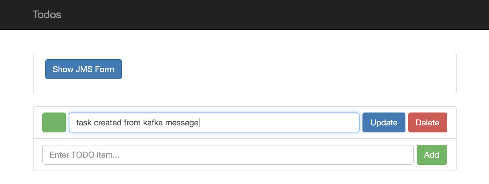

# Webhook


## Introduction

This quickstart demonstrates how to use a Kafka topic in an integration to insert records into a database. **Before you can start you will need a Kafka Broker**. To setup a Kafka broker on in your `my-project` namespace on Minishift follow the instructions on [KafkaBrokerDeployment.md](KafkaBrokerDeployment.md).

## Screencast of this Quickstart

Link to a screencast of this quickstart on our youtube channel:

[](https://youtu.be/TtVUNC51Ldk)


## Getting Started

First make sure you have a running Kafka broker and you created a Kafka Connection (see the introduction above). In the Syndesis UI navigate to `Integrations` and click on the `Import` button in the right top corner. Now you can select the [Kafka2Db-export.zip](Kafka2Db-export.zip?raw=true) file and start the import. Alternatively you can start with a create a new integration, and select the kafka message broker as it's start connection.

Select the `my-topic` topic, click 'next',
select JSON Instance and add an example JSON message such as:

```
{ "task":"some value"}
```

Click Done, and now add the Postgres SampleDB connection and use 

```
INSERT INTO TODO ( task ) VALUES ( :#task )
```
 
Finally, I'm going to let you in on a little secret (ssshh..). Besides collections, the SQL Connector can handle single elements. So eventhough it is saying that you need a datamapper, we can actually ignore this warning and we're NOT adding a datamapper as the datashapes are actually compatible.

Now publish the integration calling it Kafka2Db.

## Send a message

You should still have the [kafka-producer](KafkaBrokerDeployment.md) running, so from this producer send a message with content

```
{ "task":"task created from kafka message" }
```

You should see the new task in the todo app. You can obtain the URL to this app using

```
echo https://todo-syndesis.`minishift ip`.nip.io/
```


*Figure 1. Todo App with new Tasks appearing*

## What did we learn?
* We learned how to setuop a Kafka Broker in our `my-project` namespace
* We learned how to create a connection to a kafka topic
* We got in on a little secret that the SQL connector can handle single message so we could skip the datamapper step in this case
