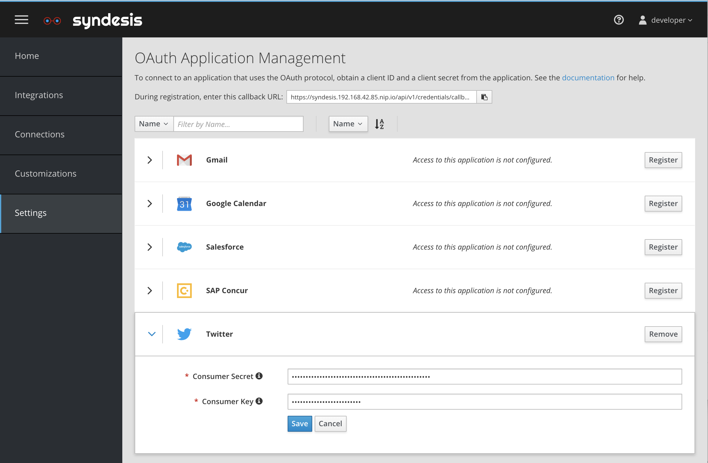
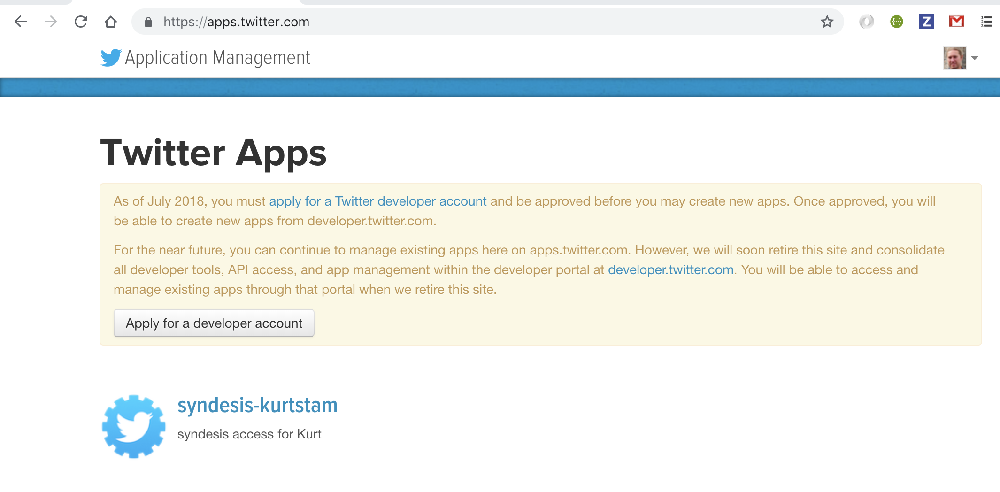
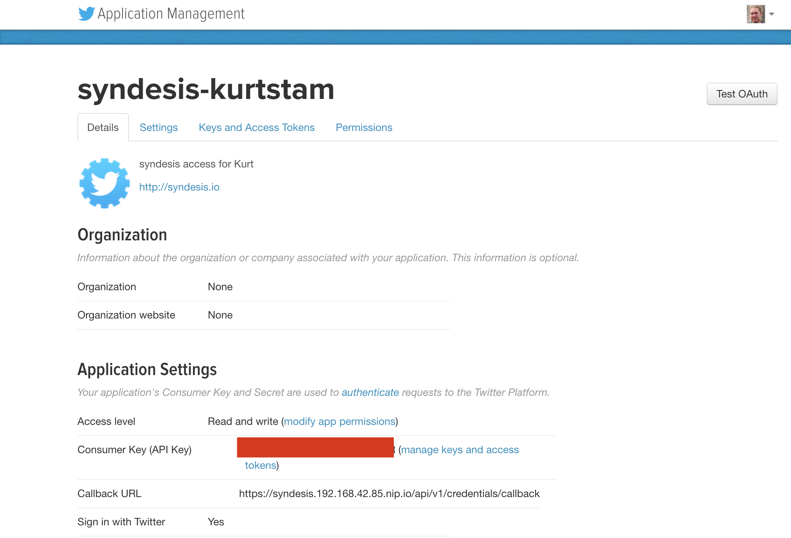
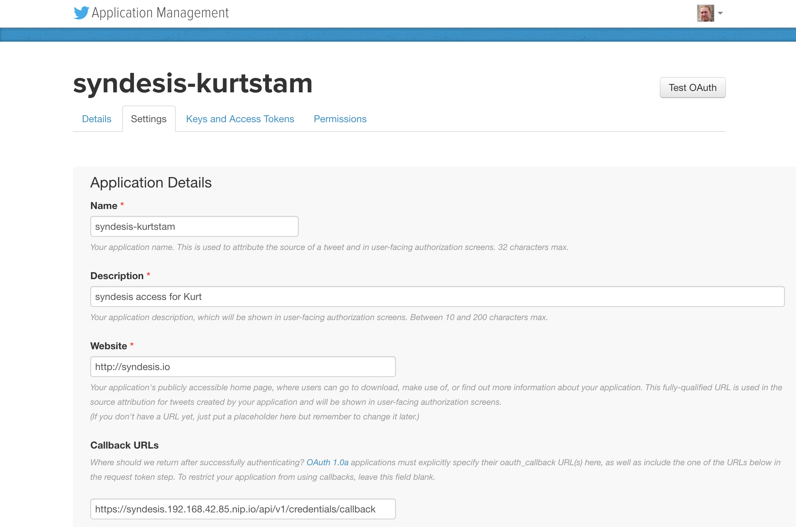
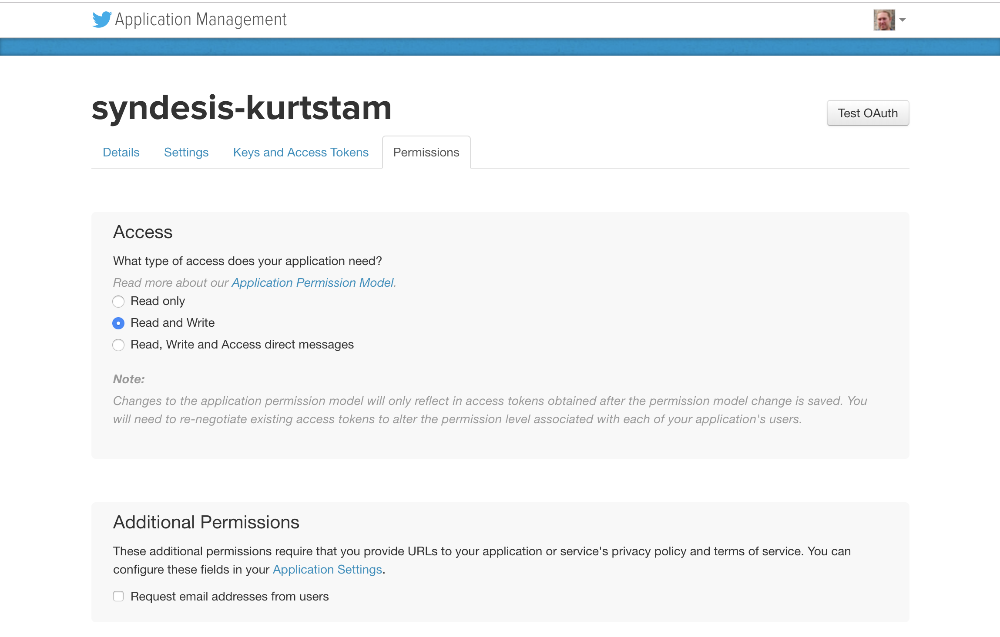

# Obtaining Credentials to use the Twitter API
The absolute first step is to have a twitter sccount. I don't think I need to help you with that but after that things get a bit more complicated. 

## Syndesis Twitter Settings
Syndesis is using the [OAuth](https://en.wikipedia.org/wiki/OAuth) Standard to connect to the Twitter API. On the `Settings` section on Syndesis it requires you to enter a Consumer Secret and Consumer Key (see Figure 1)

*Figure 1. Syndesis Twitter Settings*

## Twitter Developer Account
To obtain these you must login into https://apps.twitter.com. As it did for me you may get a banner telling you that you need to apply for a `Twitter Development Account` before you can register any new `Twitter Apps`. 

## New Twitter App
After applying you will need to wait till Twitter responds to you. Lucky for me I was grandfathered in and I had the `syndeses-kurtstam` app still sitting there and clicking on it gives you the settings for this application.

*Figure 2. Twitter App Details*

*Figure 3. Twitter App Settings*

Make sure you copy paste the callback URL from figure 1 into the callback URL here.

*Figure 4. Twitter App Keys*

From this screen you can obtain the Consumer Secret and Consumer Key to be used in the Syndesis Settings > Twitter.

*Figure 5. Twitter App Permissions*

