# Obtaining Credentials to use the GMail API
The absolute first step is to have a gmail account. I don't think I need to help you with that but after that things get a bit more complicated. 

## Syndesis GMail Settings
Syndesis is using the [OAuth](https://en.wikipedia.org/wiki/OAuth) Standard to connect to the GMail API. On the `Settings` section on Syndesis it requires you to enter a Consumer Secret and Consumer Key (see Figure 1)

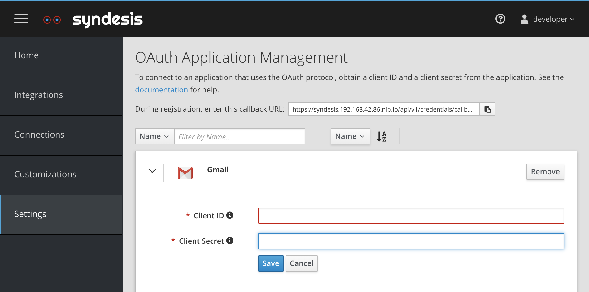
*Figure 1. Syndesis GMail Settings*

## New Google API Project
In order to obtain access to the GMail API you first need create a new project at [https://console.developers.google.com].

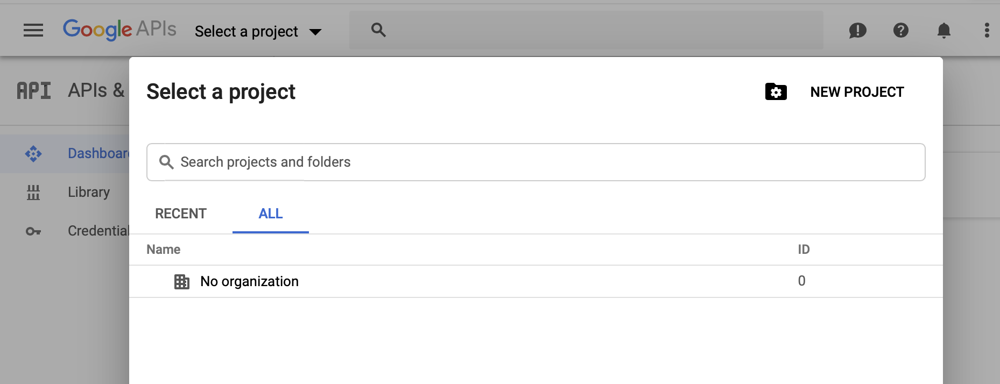
*Figure 2. Select Project*

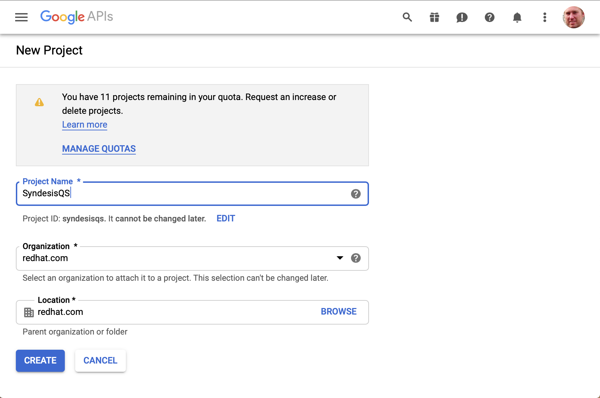
*Figure 3. Create Project `SyndesisQS`*

## Enable GMail API Service

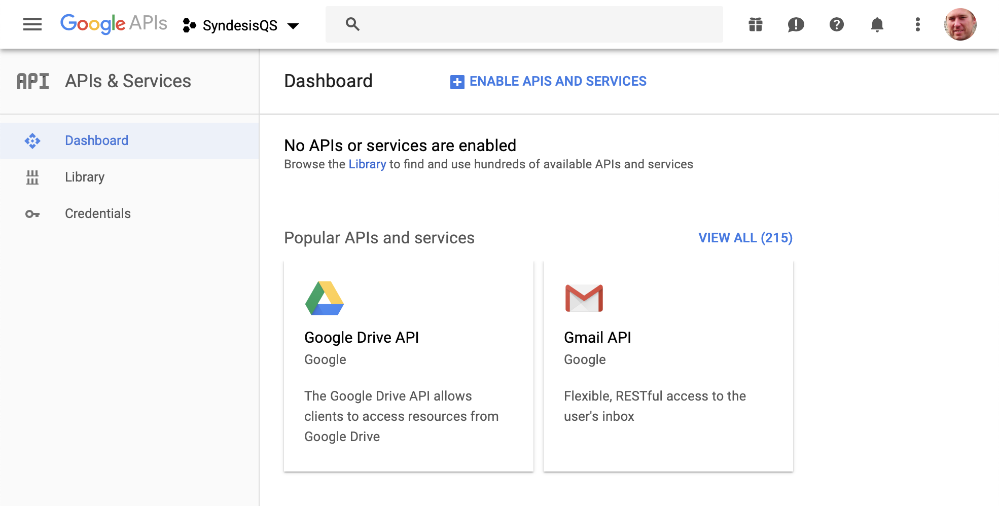
*Figure 4. API Services*

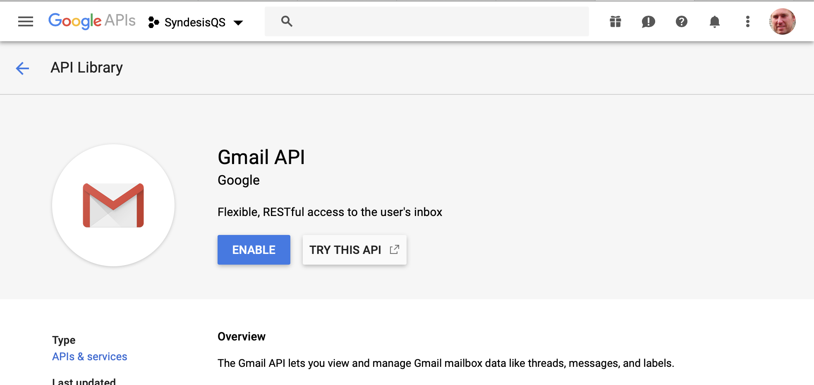
*Figure 5. Enable GMail API*

## Create Credentials

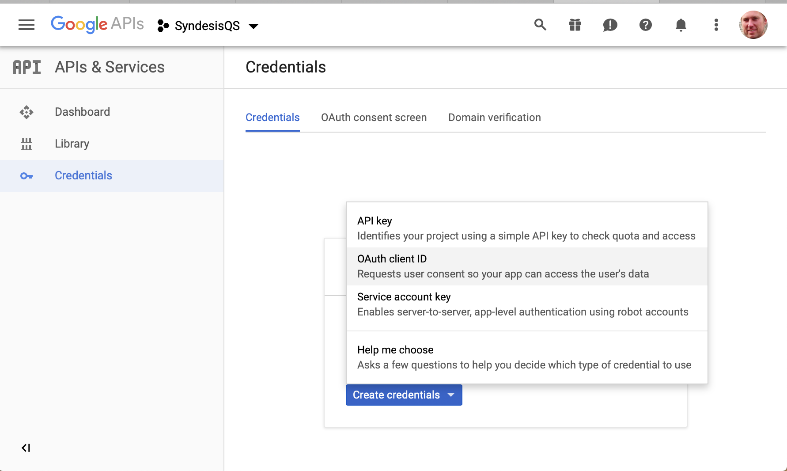
*Figure 6. Create Credentials*

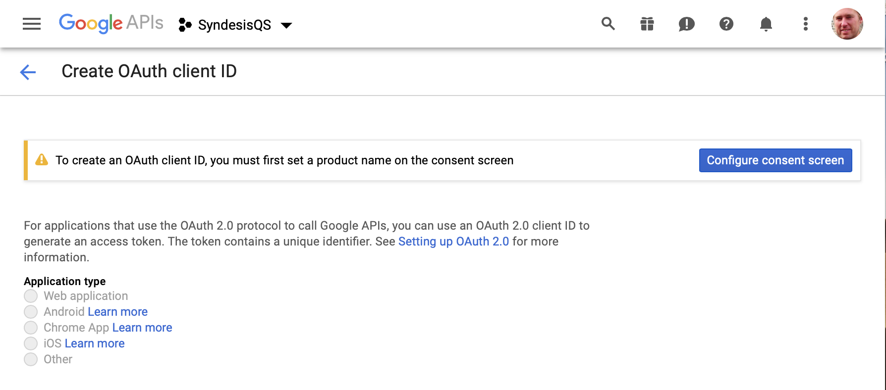
*Figure 7. Click 'Configure consent screen'*

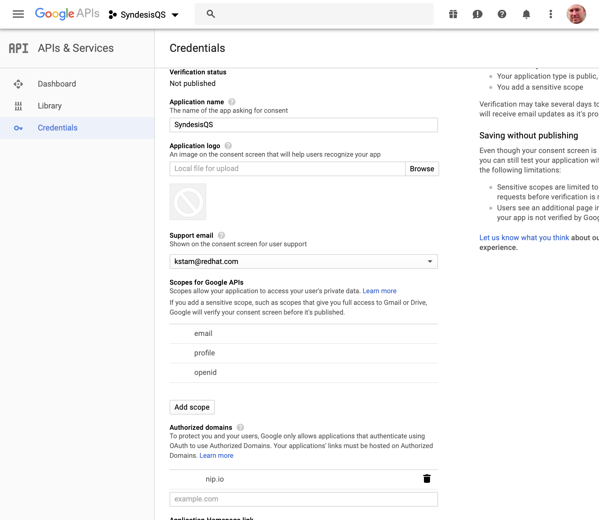
*Figure 8. Configure consent screen*

Add the Application Name and Support Email, and make sure to add the `nip.io` as an Authorized Domain!

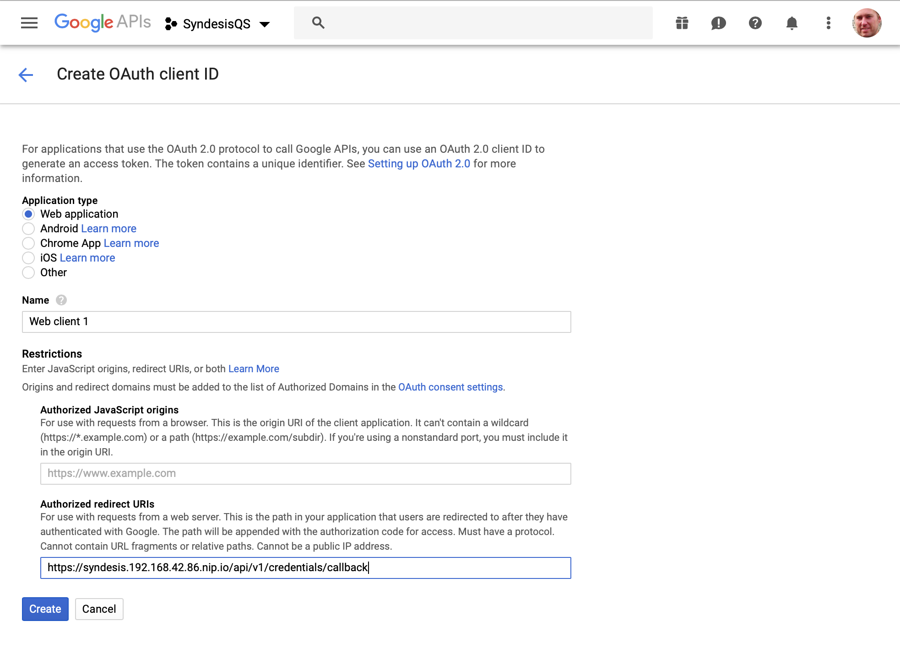
*Figure 9. Configure Web App and Callback URL*

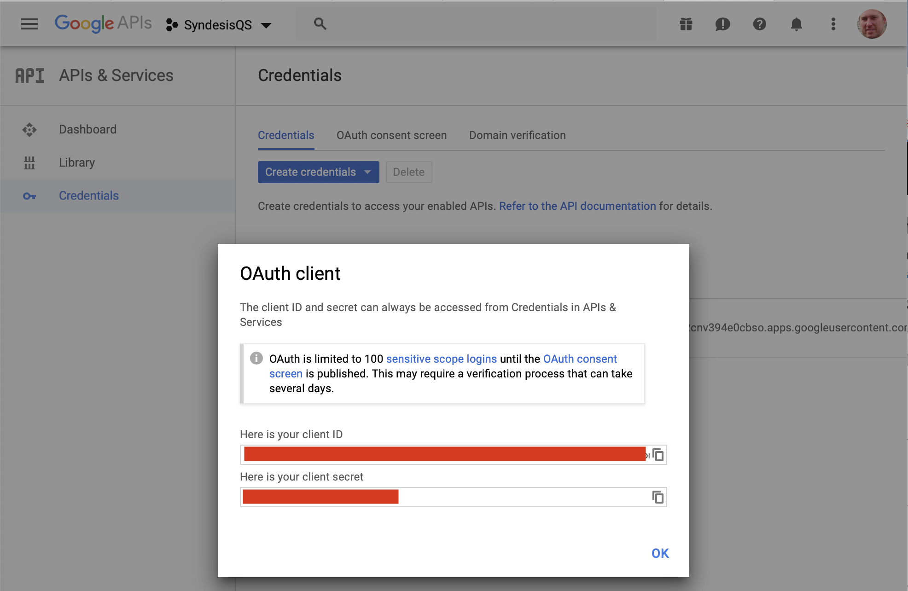
*Figure 10. Copy from Client Credentials Popup*

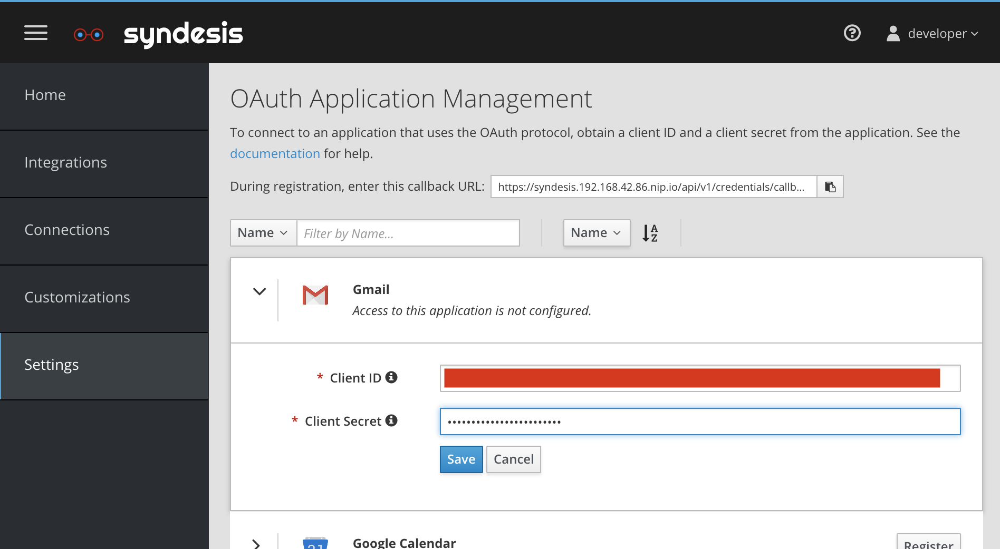
*Figure 11. Paste Client Credentials into Syndesis*

You can now create a GMail Connection and these credentials will be used.

